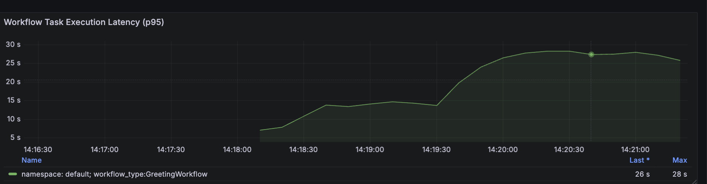
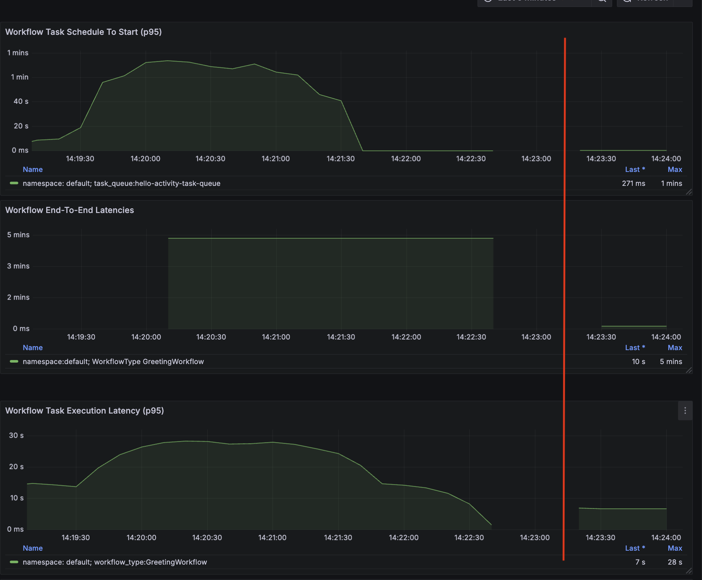

# Blocking Event Loop Example

This example demonstrates how blocking the asyncio event loop can prevent the worker from processing tasks.


As the [official doc](https://github.com/temporalio/sdk-python?tab=readme-ov-file#asynchronous-activities) from the SDK states:
> ⚠️ WARNING: Do not block the thread in async def Python functions. This can stop the processing of the rest of the Temporal.


## Install dependencies


```bash
uv python install 3.13
uv sync
uv sync --group encryption
```

## running the example


### start grafana and prometheus

```
./start-grafana_prometheus.sh
```
- Grafana: http://localhost:3000
- Prometheus: http://localhost:9090


### run the worker

```bash
uv run _worker.py
```

### start workflows

```bash
uv run _starter.py
```


#### Blocking the event loop

The file [codec.py](codec.py) in the function `encode` blocks "randomly" the asyncio thread.   

The blocking is done as part of the [codec](https://docs.temporal.io/payload-codec#payload-codec),
which is used to encrypt/decrypt the payloads.

```python
  def sleep():
     if random.random() < 0.1:
     time.sleep(0.4)

  sleep()
```


This prevents the worker from processing task to the point that they time out (default timeout=10)

This is visible in the worker logs

```
2025-04-30T14:18:45.415499Z  WARN temporal_sdk_core::worker::workflow: Task not found when completing error=status: NotFound, message: "Workflow task not found.",...
```

and grafana dashboard (**Workflow Task Execution Latency (p95)**)



The task is dispatched to the worker, but it cannot be run while the event loop is blocked.


To change the code to run with asyncio you can search for [# Simulate blocking work](./codec.py/#L28) and replace 
```python
        #asyncio.get_running_loop().run_in_executor(None, sleep)
        sleep()
```
with
```python
        asyncio.get_running_loop().run_in_executor(None, sleep)
        #sleep()
```

then restart/rerun everything to review the performance




After changing the code to run with asyncio the performance is much better, in the graph above the
change was done at 14:23:

- Workflow execution latency decreased from 3 minutes to  8 seconds (p95)
- Workflow task latency decreased from 1 minute to 7 seconds (p95)
  - It’s still relatively high due to latency added by the codec, but it’s no longer blocking the worker in the same way.
- Workflow schedule to start latency decreased from 1 minute to a few milliseconds (p95)


####  Changing the code to run purely with asyncio 

```python
        #asyncio.get_running_loop().run_in_executor(None, sleep)
        await asyncio.sleep(0.4)
        #sleep()
```

makes the real difference, but it is not always possible when we use external dependencies.