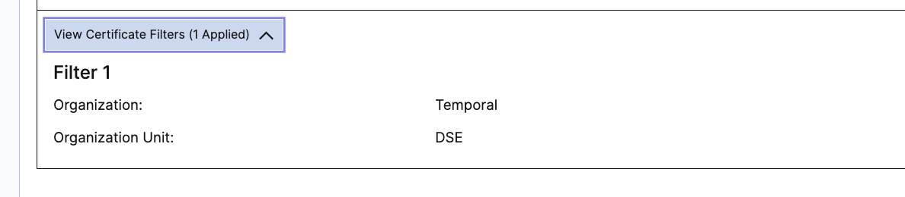

# Troubleshooting Connection Issues to Temporal Cloud

1. Verify that you can reach the namespace on port 7233

   `nc -zvw10 ${namespace}.tmprl.cloud 7233`

   If you cannot connect, your firewall or something may be blocking port 7233.
   We suggest you review it.

2. If you can run the previous command successfully, please verify if you can connect to the namespace using the [temporal cli](https://docs.temporal.io/cli) and your client certificates.

   `temporal workflow list --address ${namespace}.tmprl.cloud:7233 --namespace ${namespace} --tls-cert-path ${client.pem} --tls-key-path ${client.key}`

   If you can connect this way, but there are connectivity issues when running code, the problem could be in your code.
   We should suggest you test if you can connect by running one of our connectivity samples:

   - [Java Sample](https://github.com/temporalio/samples-java/tree/main/src/main/java/io/temporal/samples/ssl)
   - [TypeScript Sample](https://github.com/temporalio/samples-typescript/tree/main/hello-world-mtls/)
   - [Go Sample](https://github.com/temporalio/samples-go/tree/main/helloworldmtls)
   - [Python Sample](https://github.com/temporalio/samples-python/blob/main/hello/hello_mtls.py)
   - [PHP Sample](https://www.notion.so/Client-Code-to-connect-to-Cloud-6f0ab61d8a9048d28f9023d669168634?pvs=21)

3. If you get the following error `invalid peer certificate: UnknownIssuer`, this is a common error when trying to connect to Temporal Cloud from typescript within a docker image.

   - Please verify that the docker image has the package ca-certificates installed
   - See [this link](https://legacy-documentation-sdks.temporal.io/typescript/production-deploy#running-in-docker) for more information.

4. If you can not connect, the problem might be in the certificate.

   Please run this command to verify if the CA in the namespace is working with the client certificate you are using.

   `openssl s_client -connect ${namespace}.tmprl.cloud:7233 -showcerts -cert ./client.pem -key ./client.key -tls1_2 -servername ${namespace}.tmprl.cloud`

   - If you see:

     ```txt
     Error: Operation DescribeNamespace failed.
     Error Details: rpc error: code = Unavailable desc = connection closed before server preface received
     ('export TEMPORAL_CLI_SHOW_STACKS=1' to see stack traces)
     ```

     you are using the wrong client certificates and we recommend changing them.

   - If, instead, you see `Error Details: Request unauthorized.` The issue might be in the certificate filters. To verify it:

      - Navigate to your namespace `(https://cloud.temporal.io/support/namespaces/<namespace>)` and see if you have set the certificate filters.

        

        If you have certificate filters, run the following command to verify the fields set on the end-entity certificate you are using:

        `openssl x509 -in <cert_name> -text`

        The certificate filters should match the key/values on **Subject**  (the following is an example, it does not match the certificate filtered above).

        
